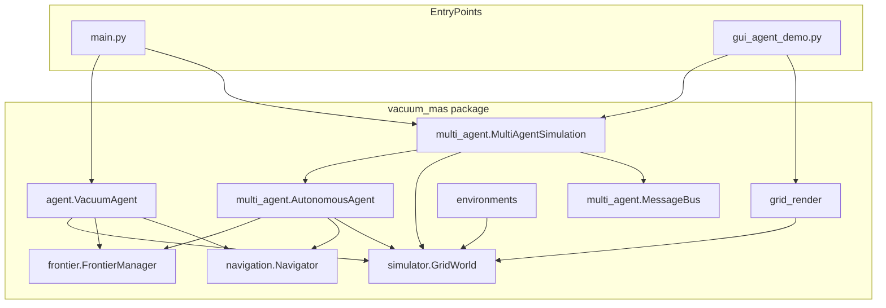
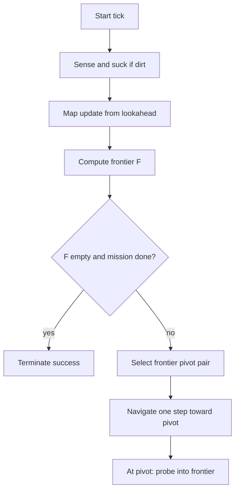
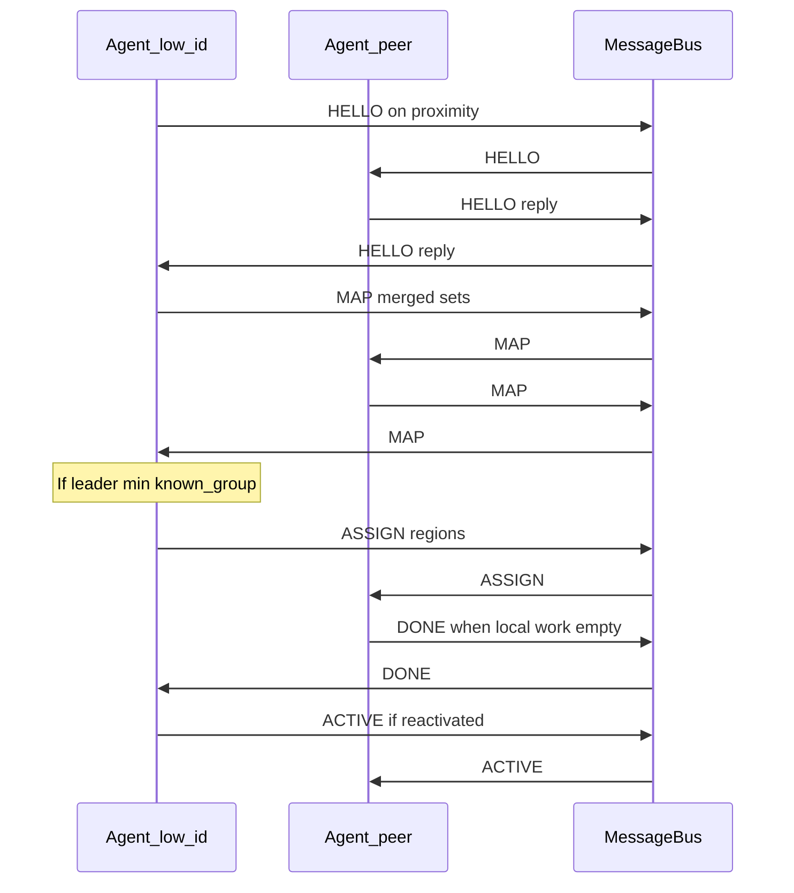

# Multi-Agent Cooperative Vacuum Cleaning System

Peer-to-peer cooperative vacuum cleaning on discrete grid worlds. Implements **Advanced Option 2**: local coordinate frames, explicit messages (`HELLO`, `MAP`, `ASSIGN`, `DONE`, `ACTIVE`), no central server, and distributed termination.

## Repository layout

| Path | Role |
|------|------|
| [`vacuum_mas/`](vacuum_mas/) | Installable package: world model, single-agent agent, multi-agent logic, environments, GUI primitives |
| [`tests/`](tests/) | `pytest` suite |
| [`main.py`](main.py) | CLI entry |
| [`gui_agent_demo.py`](gui_agent_demo.py) | Pygame GUI entry |
| [`docs/`](docs/) | Notes on external assignment PDF |
| [`pyproject.toml`](pyproject.toml) | Package metadata and pytest `pythonpath` |

Core runtime uses the Python standard library only. **Pygame** is optional (GUI). **pytest** is for tests.

## Architecture (components)

High-level module relationships (arrows read as “uses” or “drives”).



## Single-agent control loop

One tick of [`vacuum_mas/agent.py`](vacuum_mas/agent.py) (`VacuumAgent`): sense and clean, update map from forward lookahead, maintain frontier `F`, navigate toward a pivot, probe into the frontier cell.



## Multi-agent message flow

Discovery uses the simulator’s proximity / offset sensor; then peers exchange frames and maps; the lowest-ID agent in the known group acts as leader and sends `ASSIGN`; agents signal `DONE` / `ACTIVE` for distributed completion.



## Assignment report vs this code

The course PDF may describe a richer protocol (e.g. **PING**, **ACK**, **IDLE**, **UNDONE**) and stochastic message loss. **This repository implements a concrete subset** aligned with the running simulator:

- Messages: **`HELLO`**, **`MAP`**, **`ASSIGN`**, **`DONE`**, **`ACTIVE`**
- In-process **`MessageBus`** (reliable delivery for the simulation)
- Leader rule: **minimum agent ID** in the known peer set

Treat the PDF as the narrative specification; treat this repo as the executable reference model.

## Quick start

From the repository root (`multi-agent-vacuum-cleaner/`):

```bash
python3 -m pip install -r requirements.txt
# Optional GUI:
python3 -m pip install -r requirements-gui.txt
# Editable install (optional, for imports from other directories):
python3 -m pip install -e ".[test,gui]"
```

### GUI (interactive)

```bash
python3 gui_agent_demo.py
python3 gui_agent_demo.py --layout cave --agents 4
```

### CLI (batch)

```bash
python3 main.py --layout single --agents 3
python3 main.py --layout all --mode single
python3 main.py --layout cave --agents 4
```

### Tests

```bash
python3 -m pytest tests/ -v
```

## Package map

| Module | Role |
|--------|------|
| `vacuum_mas/state.py` | Agent pose, heading, M/O/U sets, `rotate_cw` / `rotate_ccw` |
| `vacuum_mas/utils.py` | Grid helpers, Manhattan distance, headings |
| `vacuum_mas/simulator.py` | Ground truth `GridWorld`, sensors and actuators, multi-agent presence |
| `vacuum_mas/frontier.py` | Frontier set and selection heuristics |
| `vacuum_mas/navigation.py` | BFS paths on known-free cells |
| `vacuum_mas/agent.py` | Single-agent `VacuumAgent` |
| `vacuum_mas/multi_agent.py` | `MessageBus`, `AutonomousAgent`, `MultiAgentSimulation` |
| `vacuum_mas/environments.py` | Procedural caves, floor plans, warehouse |
| `vacuum_mas/grid_render.py` | Pygame drawing helpers |
| `vacuum_mas/visualization.py` | Optional ASCII belief rendering |

## GUI controls

| Key | Action |
|-----|--------|
| `Space` | Play / Pause |
| `Right` | Single step (when paused) |
| `Up` / `Down` | Speed up / slow down |
| `R` | Reset simulation |
| `1`–`8` | Switch layout |
| `N` | Cycle agent count (2 → 3 → 4) |
| `Tab` | Highlight next agent |
| `L` | Toggle lookahead sensor |
| `Q` / `Esc` | Quit |

## Dependencies

- Python 3.10+
- `pygame` (GUI only; see `requirements-gui.txt`)
- `pytest` (tests; see `requirements.txt`)
# multi-agent-vacuum-cleaner
